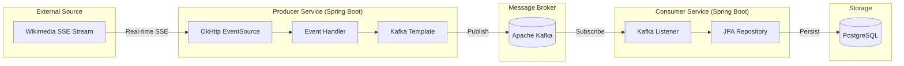

# 🚀 Distributed Event Streaming: Wikimedia Real-Time Data Pipeline

This project demonstrates a robust, **Event-Driven Architecture (EDA)** designed to ingest, stream, and persist high-velocity data in real-time. By leveraging **Apache Kafka** and **Spring Boot**, it provides a scalable solution for processing asynchronous event streams from the Wikimedia Foundation.

---

## 📖 Project Overview

The system is engineered to handle the full lifecycle of real-time data, from ingestion to long-term persistence. It bridges the gap between a high-frequency external data source and a reliable storage layer.

- **🎯 Purpose:** To implement a resilient data pipeline that captures live global edits, ensuring data integrity through asynchronous message brokering.
- **🏗️ Design Philosophy:** The system prioritizes **Loose Coupling**, allowing the data producer and database consumer to scale independently while managing backpressure and ensuring fault tolerance.

---

## 🛠️ Architectural Flow

---

## ⚡ Reactive Stream Consumption: OkHttp EventSource

A critical component of this architecture is the use of **OkHttp EventSource** for data ingestion. 

### Why OkHttp EventSource?
Standard REST APIs follow a "request-response" model, which is inefficient for live updates. This project uses **Server-Sent Events (SSE)**, where the server keeps a single connection open and "pushes" data to the client as it occurs.

> [!IMPORTANT]
> **Reactive Ingestion:** The `okhttp-eventsource` library allows the Producer to maintain a persistent, non-blocking connection. This ensures the application reacts only when an event arrives, significantly reducing CPU and memory overhead compared to traditional polling.

- **Non-blocking IO:** Processes events in a background thread, keeping the main application thread free.
- **Auto-reconnection:** Built-in resilience to handle connection drops, ensuring the data pipeline remains continuous.
- **Backpressure Ready:** By immediately handing off events to Kafka, the Producer remains lightweight and never gets overwhelmed by the source stream.

---

## 🧩 Core Components

### 1️⃣ Ingestion Layer (The Producer)
The `kafka-producer-wikimedia` module acts as a reactive gateway. 
- **Mechanism:** Transforms live SSE data into discrete Kafka messages in real-time.
- **Abstraction:** The background handler ensures that ingestion logic is cleanly separated from transport logic.

### 2️⃣ Orchestration Layer (The Message Broker)
**Apache Kafka** serves as the system's backbone, providing a durable and partitioned transport mechanism.
- **Buffering:** Kafka ensures that fluctuations in stream velocity do not impact database performance.
- **Durability:** Even if the consumer service is temporarily offline, Kafka persists the data until it is successfully processed.

### 3️⃣ Persistence Layer (The Consumer)
The `kafka-consumer-database` module manages the data lifecycle and storage.
- **Asynchronous Pull:** Utilizes a Kafka Listener to pull messages at a rate the database can handle.
- **ORM Mapping:** Payloads are mapped to JPA Entities for structured and reliable storage.

---

## 🧰 Technical Stack

| Category | Technology |
| :--- | :--- |
| **Framework** |  |
| **Messaging** |  |
| **Inbound Stream** |  (EventSource) |
| **Database** |  |
| **Persistence** | Hibernate / Spring Data JPA |

---

## ⚙️ Extensibility

The system is built with an **Environment-Agnostic** architecture. All infrastructure details—such as broker addresses, stream endpoints, and database credentials—are managed through externalized configuration (`application.properties` or environment variables). This allows for seamless deployment across Development, Staging, and Production environments.

---
*This project serves as a foundational blueprint for modern Event-Driven Architectures (EDA) and Real-time Data Pipelines.*
