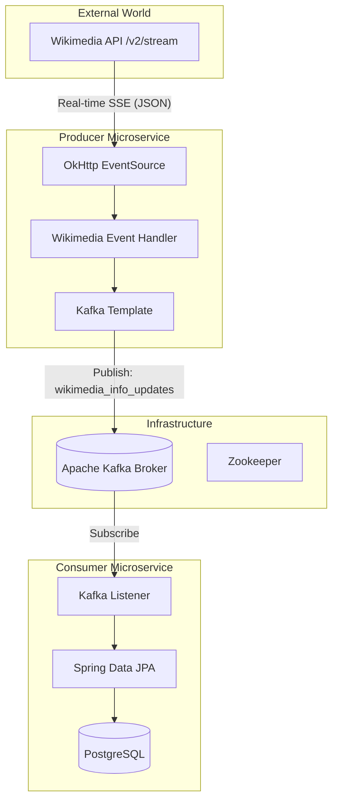

# 🌟 Distributed Real-Time Data Pipeline: Wikimedia Recent Changes


An enterprise-grade, event-driven microservices ecosystem designed for high-velocity data ingestion. This project serves as a comprehensive blueprint for building scalable data pipelines that process live streams using **Reactive Event Sourcing**, **Distributed Messaging**, and **Relational Persistence**.

---

## 📖 Table of Contents
- [Project Overview](#-project-overview)
- [System Architecture](#-system-architecture)
- [Module Deep Dive](#-module-deep-dive)
- [Technical Flow Explanation](#-technical-flow-explanation)
- [Step-by-Step Configuration](#-step-by-step-configuration)
- [How to Run & Verify](#-how-to-run--verify)
- [Tech Stack & Dependencies](#-tech-stack--dependencies)

---

## 📌 Project Overview

This project is a multi-module Spring Boot application that demonstrates how to handle **Server-Sent Events (SSE)** at scale. It consumes a live "Recent Changes" stream from Wikimedia, processes the events through a distributed **Kafka Cluster**, and persists the raw JSON data into a **PostgreSQL** database.

### 🌟 Key Features
- **Reactive Ingestion:** Uses non-blocking I/O to maintain persistent stream connections.
- **Backpressure Management:** Decouples producer and consumer to protect downstream systems from traffic spikes.
- **Distributed Reliability:** Leverages Kafka's partitioning and persistence for zero data loss.
- **Clean Architecture:** Modular design separating ingestion logic from persistence logic.

---

## 🏗️ System Architecture

The architecture follows a classic **Producer-Broker-Consumer** pattern, optimized for high throughput.



---

## 🔍 Module Deep Dive

### 1. Ingestion Layer (`kafka-producer-wikimedia`)
This module is the entry point for the data pipeline.
- **`WikimediaEventChangesProducer`**: Orchestrates the connection. It uses `OkHttpClient` with a custom `User-Agent` to connect to the Wikimedia stream and starts a `BackgroundEventSource`.
- **`WikimediaEventChangesHandler`**: A reactive handler that implements `BackgroundEventHandler`. It reacts to `onMessage`, logs the event, and pushes the data to the Kafka topic.
- **`KafkaTopicConfig`**: Programmatically defines the `wikimedia_info_updates` topic using Spring Kafka's `TopicBuilder`.

### 2. Persistence Layer (`kafka-consumer-database`)
This module handles the data lifecycle.
- **`KafkaConsumerDatabase`**: Contains the `@KafkaListener`. It consumes messages from the `myGroup` consumer group and passes them to the repository.
- **`Wikimedia` Entity**: Uses `@Lob` (Large Object) to store raw event JSONs and a `UUID` for primary keys.
- **`WikimediaEventDataRepository`**: A standard JpaRepository for PostgreSQL persistence.

---

## 🔄 Technical Flow Explanation

1.  **Handshake:** The Producer microservice initiates an HTTP GET request to the Wikimedia SSE endpoint.
2.  **Streaming:** The connection remains open. Whenever a global edit occurs, Wikimedia pushes a JSON event.
3.  **Handling:** The `BackgroundEventSource` receives the event. The `onMessage()` callback is triggered.
4.  **Publishing:** The `KafkaTemplate` sends the message string to the Kafka broker.
5.  **Buffering:** Kafka stores the message in the `wikimedia_info_updates` topic. If the consumer is busy, Kafka buffers the data.
6.  **Listening:** The Consumer microservice's `@KafkaListener` detects a new message in the topic.
7.  **Commit:** The message is mapped to a JPA entity and saved to the `wikimedia_recent_info` table in PostgreSQL.

---

## 🛠️ Step-by-Step Configuration

### 1. Prerequisites
- **JDK 17+**
- **Apache Kafka** (Local or Docker)
- **PostgreSQL** (Local or Docker)

### 2. Infrastructure Setup
**Start Kafka (Standard Installation):**
```bash
# Start Zookeeper
bin/zookeeper-server-start.sh config/zookeeper.properties

# Start Kafka Broker
bin/kafka-server-start.sh config/server.properties
```

**Setup Database:**
Login to PostgreSQL and run:
```sql
CREATE DATABASE wikimedia;
```

### 3. Application Properties
Configure your local credentials in the respective `src/main/resources/application.properties` files:

**Producer Module:**
```properties
spring.kafka.producer.bootstrap-servers=localhost:9092
stream-wikimedia-url=https://stream.wikimedia.org/v2/stream/recentchange
```

**Consumer Module:**
```properties
spring.datasource.url=jdbc:postgresql://localhost:5432/wikimedia
spring.datasource.username=postgres
spring.datasource.password=your_password
spring.jpa.hibernate.ddl-auto=update
```

---

## 🚀 How to Run & Verify

1.  **Build the Project:**
    ```bash
    mvn clean install
    ```

2.  **Start the Services (Order is important):**
    - First, run the **Consumer Application** to ensure the listener is ready.
    - Second, run the **Producer Application** to start streaming data.

3.  **Verification:**
    - Check the logs for `EVENT RECEIVED` in the Producer.
    - Check the logs for `Receive message from topic` in the Consumer.
    - Query the database to see live data:
      ```sql
      SELECT * FROM wikimedia_recent_info LIMIT 10;
      ```

---

## 🧰 Tech Stack Detail

- **Language:** Java 17
- **Framework:** Spring Boot 4.0.6 (Latest Parent)
- **Messaging:** Spring Kafka
- **HTTP Client:** OkHttp 4.12.0
- **Reactive Stream:** LaunchDarkly EventSource 4.3.0
- **Database:** PostgreSQL with Spring Data JPA
- **Serialization:** Jackson (JSON processing)
- **Utility:** Project Lombok

---
*Developed by Kishore — Focused on High-Performance Event-Driven Architectures.*
