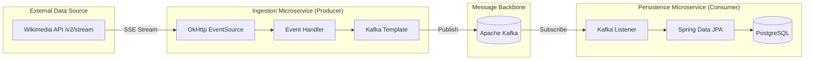

# Wikimedia Kafka Real-Time Stream Processing

[](https://spring.io/projects/spring-boot)
[](https://kafka.apache.org/)
[](https://www.oracle.com/java/)
[](https://www.postgresql.org/)

A high-performance, event-driven data pipeline designed to ingest, stream, and persist real-time global change events from Wikimedia. This project leverages the scalability of **Apache Kafka** and the robustness of **Spring Boot** to build a decoupled microservices architecture.

---

## 🚀 Project Overview

This project implements a complete **Reactive Stream Processing Pipeline**. It captures live "recent change" events broadcasted by the [Wikimedia EventStreams API](https://stream.wikimedia.org/v2/stream/recentchange) and processes them through a distributed messaging system.

### Key Objectives
*   **Real-Time Ingestion:** Synchronous capture of global Wikimedia edits via Server-Sent Events (SSE).
*   **Asynchronous Processing:** Decoupling data production from consumption using Kafka to ensure system resilience and backpressure management.
*   **Reliable Persistence:** Storing high-velocity event data into a relational database for auditing and analytical purposes.

---

## 🏗️ Architecture & Technical Flow

The system is composed of two primary microservices mediated by a Kafka broker.



### 1. The Producer Layer (`kafka-producer-wikimedia`)
Uses **OkHttp** and **LaunchDarkly EventSource** to maintain a persistent connection to the Wikimedia stream. 
*   **Reactive Handling:** Implements `BackgroundEventHandler` to process incoming JSON payloads asynchronously.
*   **Topic Publishing:** Messages are serialized and sent to the `wikimedia_info_updates` topic.

### 2. The Storage Layer (`kafka-consumer-database`)
Acts as a dedicated worker to persist the incoming data stream.
*   **Kafka Listener:** Monitors the Kafka topic and triggers on every new message.
*   **JPA Entity Mapping:** Maps the raw event data to a `Wikimedia` entity and saves it to a PostgreSQL table (`wikimedia_recent_info`).

---

## 🛠️ Configuration & Setup

### Prerequisites
*   **Java 17** or higher
*   **Apache Kafka** (running on port 9092)
*   **PostgreSQL** (running on port 5432)
*   **Maven** (for building the modules)

### Step-by-Step Installation

1.  **Clone the Repository:**
    ```bash
    git clone https://github.com/BKishoree/wikimedia_recentchange_apachekafka.git
    cd wikimedia
    ```

2.  **Infrastructure Setup:**
    *   Start your Zookeeper and Kafka server.
    *   Create a PostgreSQL database named `wikimedia`.

3.  **Environment Configuration:**
    Update the `application.properties` files in both modules if your local setup differs:
    *   **Producer:** `kafka-producer-wikimedia/src/main/resources/application.properties`
    *   **Consumer:** `kafka-consumer-database/src/main/resources/application.properties`

4.  **Build and Run:**
    ```bash
    # Build the entire project
    mvn clean install

    # Run the Consumer Service
    cd kafka-consumer-database
    mvn spring-boot:run

    # Run the Producer Service
    cd ../kafka-producer-wikimedia
    mvn spring-boot:run
    ```

---

## ⚡ Technical Highlights

### Reactive Stream Consumption (SSE)
The project utilizes **OkHttp EventSource** to handle Server-Sent Events. Unlike traditional polling, SSE allows the server to push updates to the client as they occur, making it ideal for high-frequency streams like Wikimedia's recent changes.

### Scalability and Fault Tolerance
By using Kafka as a buffer:
*   **Backpressure Management:** The consumer can process data at its own pace without overwhelming the database.
*   **Persistence Guarantee:** Even if the consumer service goes down, Kafka retains the messages until the service recovers.

---

## 🧰 Tech Stack
*   **Framework:** Spring Boot (Starter Kafka, Data JPA)
*   **Messaging:** Apache Kafka
*   **Reactive Client:** OkHttp, LaunchDarkly EventSource
*   **Database:** PostgreSQL
*   **Utilities:** Project Lombok, Jackson (JSON processing)

---
*Developed as a reference for Event-Driven Microservices.*
